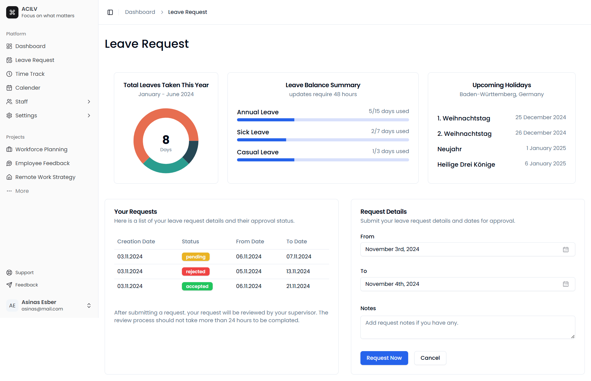

# ACILV

ACILV is a Time Tracking web-based application built with Next.js and React. It is designed to help manage employee data, leave requests, and time tracking efficiently.



## Table of Contents

- [Installation](#installation)
- [Running the Project](#running-the-project)
- [Default Credentials](#default-credentials)
- [Technologies Used](#technologies-used)
- [Features](#features)

## Installation

Before you begin, ensure you have [Node.js](https://nodejs.org/) and npm installed on your system.

1. **Clone the repository:**

   ```bash
   git clone git@gitlab.com:slurp34/swt-project-waterfall.git
   ```

2. **Navigate to the project directory:**

   ```bash
   cd swt-project-waterfall
   ```

3. **Install dependencies:**

   ```bash
   npm install
   ```

## Running the Project

Start the development server by running:

```bash
npm run dev
```

Open your browser and visit [http://localhost:3000](http://localhost:3000) to view the application.

## Default Credentials

Use the following credentials to log in:

- **Email:** asinas@mail.com
- **Password:** pass

## Technologies Used

- **Next.js**: A React framework for building server-rendered applications.
- **React**: A JavaScript library for building user interfaces.
- **Tailwind CSS**: A utility-first CSS framework for rapid UI development.
- **Shadcn UI**: A collection of customizable UI components.
- **BetterAuth**: Authentication library for secure user login.
- **Drizzle ORM**: An object-relational mapping tool for database interactions.
- **SQLite**: A lightweight, file-based SQL database.

## Features

- **User Authentication:**
  - Secure login using email and password.
  - Middleware protection for route access.

- **Dashboard Layout:**
  - Modular components for easy maintenance.
  - Collapsible sidebar for intuitive navigation.

- **Leave Requests:**
  - Create and submit leave requests.
  - Requests are saved and managed in the database.

- **Time Tracking:**
  - Interactive interface for logging time.
  - User-friendly and efficient time management.

---

For more screenshots, please check our [Screenshots Directory](screenshots/README.MD).